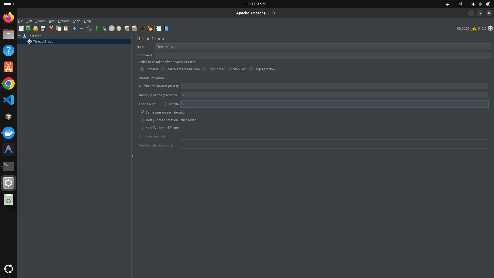
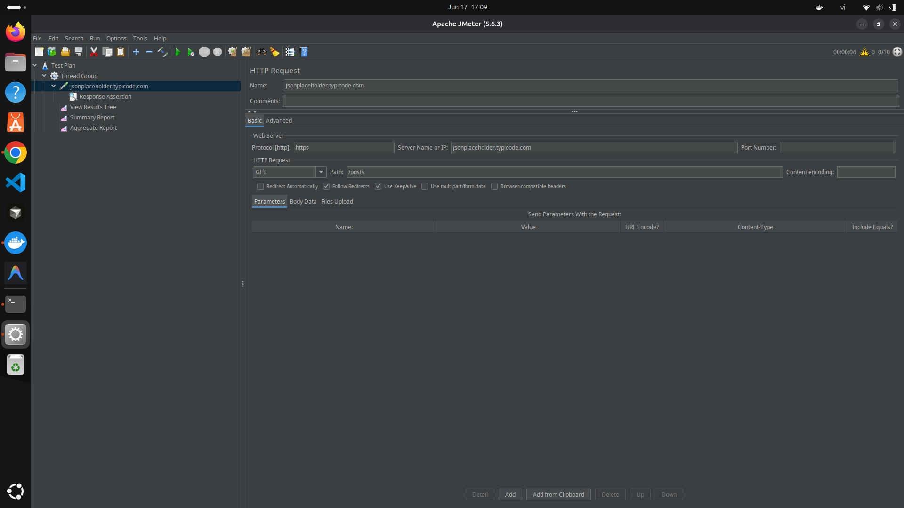
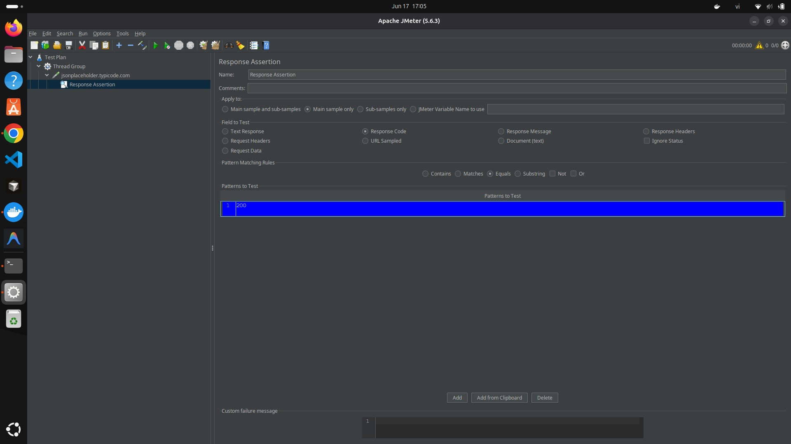
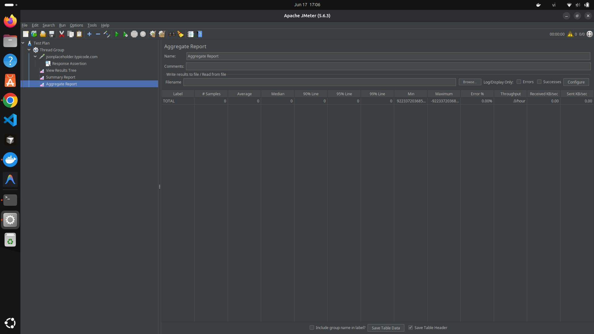
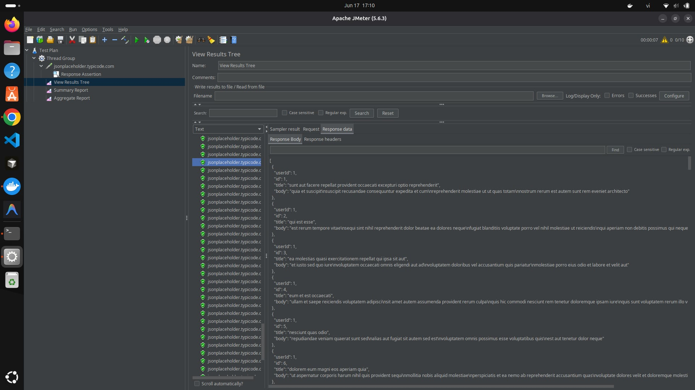
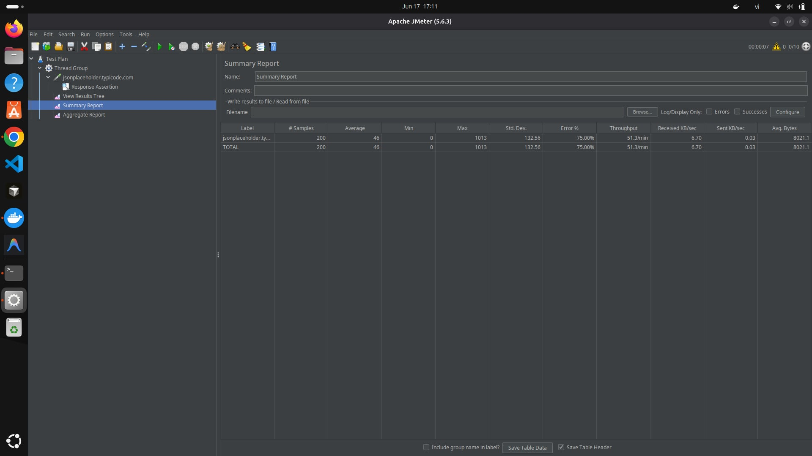
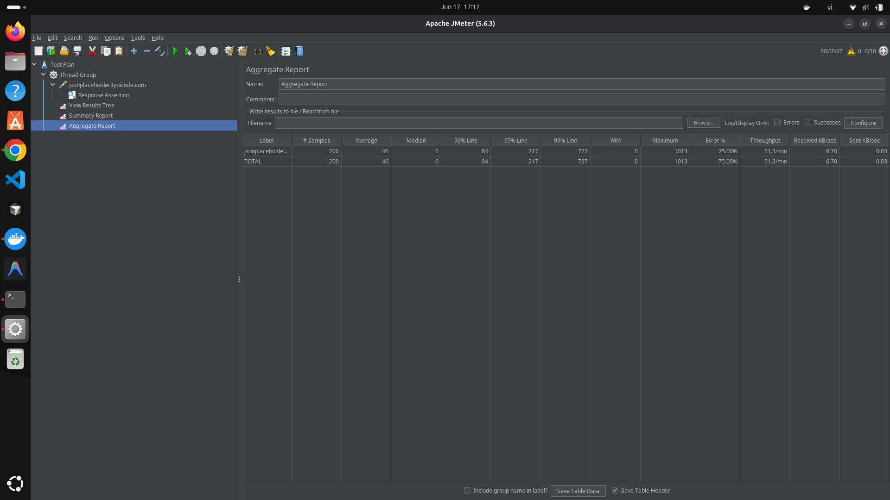

# Báo cáo học JMeter - Kiểm thử hiệu năng (Performance Testing)

## 1. Giới thiệu

Apache JMeter là công cụ mã nguồn mở dùng để kiểm thử hiệu năng (performance/load testing): giả lập nhiều người dùng cùng gửi request tới một server/API trong một khoảng thời gian, từ đó đo được server chịu tải tốt đến đâu, tốc độ phản hồi trung bình là bao nhiêu, và tỉ lệ lỗi khi có nhiều người dùng cùng lúc. Khác với Postman (kiểm tra một request có trả đúng dữ liệu không — functional testing), JMeter tập trung vào việc đo lường tốc độ và độ ổn định của hệ thống dưới tải, không quan tâm nhiều đến nội dung response đúng/sai mà quan tâm đến thời gian phản hồi và khả năng chịu tải.

Mục tiêu bài báo cáo: thực hành tạo một Test Plan trong JMeter, cấu hình Thread Group để giả lập nhiều người dùng, gửi HTTP Request tới một API, thêm Assertion kiểm tra kết quả, và đọc hiểu các báo cáo (Summary Report, Aggregate Report) để đánh giá hiệu năng.

**Nguồn học:**
- Video hướng dẫn: https://www.youtube.com/watch?v=NTyY8wKSvik

## 2. Công cụ và đối tượng kiểm thử

- Công cụ: Apache JMeter (<!-- THAY VÀO: phiên bản JMeter bạn cài, xem ở Help > About -->)
- API kiểm thử: `https://jsonplaceholder.typicode.com/posts`

---

## 3. Thiết lập Test Plan

### 3.1 Thread Group

Cấu hình giả lập người dùng:

| Thông số | Giá trị |
|---|---|
| Number of Threads (users) | 10 |
| Ramp-up period (seconds) | 5 |
| Loop Count | 5 |

Ý nghĩa: 10 người dùng giả lập sẽ lần lượt bắt đầu gửi request, dàn trải đều trong 5 giây đầu, mỗi người gửi lặp lại 5 lần → tổng cộng 50 request được gửi trong bài test này.

### Hình minh hoạ
<!-- THAY ẢNH THẬT -->

### 3.2 HTTP Request Sampler

| Thông số | Giá trị |
|---|---|
| Protocol | https |
| Server Name | jsonplaceholder.typicode.com |
| Method | GET |
| Path | /posts |

### Hình minh hoạ
<!-- THAY ẢNH THẬT -->

### 3.3 Response Assertion

Thêm Assertion kiểm tra mỗi response trả về phải có response code `200`, nếu không sẽ được JMeter đánh dấu lỗi (fail) trong báo cáo.

### Hình minh hoạ
<!-- THAY ẢNH THẬT -->

### 3.4 Listeners

Thêm 3 Listener để theo dõi kết quả: **View Results Tree** (xem chi tiết từng request/response), **Summary Report** (số liệu tổng hợp), **Aggregate Report** (số liệu tổng hợp kèm percentile).

### Hình minh hoạ
<!-- THAY ẢNH THẬT: ảnh cây Test Plan ở khung bên trái, thấy đủ Thread Group > HTTP Request, Assertion, 3 Listener -->

---

## 4. Chạy test và kết quả

### 4.1 View Results Tree

Sau khi chạy (Ctrl+R), các request hiện màu xanh nghĩa là Pass (status 200, đúng Assertion). Xem nội dung Response Data của một request mẫu để xác nhận dữ liệu trả về là danh sách bài viết dạng JSON.

### Hình minh hoạ
<!-- THAY ẢNH THẬT -->

### 4.2 Summary Report

| Label | # Samples | Average (ms) | Min (ms) | Max (ms) | Error % | Throughput (req/sec) |
|---|---|---|---|---|---|---|
| TOTAL | 200 | 46 | 0 | 1013 | 75.00% | 51.3/min |

<!-- THAY SỐ LIỆU THẬT: đọc trực tiếp từ bảng Summary Report sau khi chạy test trong JMeter, điền đúng số bạn đo được -->

### Hình minh hoạ
<!-- THAY ẢNH THẬT -->

### 4.3 Aggregate Report

| Label | # Samples | Average (ms) | 90% Line | 95% Line | 99% Line | Error % | Throughput |
|---|---|---|---|---|---|---|---|
| TOTAL | 200 | 46 | 84 | 217 | 727 | 75.00% | 51.3/min |

<!-- THAY SỐ LIỆU THẬT -->

Giải thích nhanh: 90% Line nghĩa là 90% số request có thời gian phản hồi nhỏ hơn hoặc bằng giá trị này — đây là chỉ số quan trọng hơn Average vì Average dễ bị che lấp bởi vài request nhanh bất thường.

### Hình minh hoạ
<!-- THAY ẢNH THẬT -->

---

## 5. Test Plan file

File Test Plan đã lưu và đính kèm trong repo này: [`load-test-posts.jmx`](./load-test-posts.jmx)

Cách import: mở JMeter → File → Open → chọn file `load-test-posts.jmx`.

<!-- LƯU Ý: nhớ thật sự Save Test Plan trong JMeter (Ctrl+S) và đẩy file .jmx này lên cùng repo -->

## 6. Kết luận

Qua bài thực hành, đã học và áp dụng được:

- Cấu hình Thread Group để giả lập nhiều người dùng cùng gửi request (Number of Threads, Ramp-up, Loop Count)
- Tạo HTTP Request Sampler để gửi request tới API thật
- Thêm Response Assertion để tự động kiểm tra mỗi response có đúng status code mong đợi không
- Đọc và hiểu các chỉ số hiệu năng quan trọng: Average, Min/Max, Error %, Throughput, và các mốc Percentile (90%/95%/99%) trong Aggregate Report
- Nhận ra sự khác biệt giữa JMeter (đo hiệu năng dưới tải) và Postman (kiểm tra tính đúng đắn của từng request riêng lẻ)

<!-- THAY VÀO: 1-2 câu nhận xét riêng của bạn, ví dụ server có chịu tải tốt không, error % cao hay thấp, có gì bất ngờ khi tăng số luồng -->

## 7. Tài liệu tham khảo

- Video hướng dẫn: https://www.youtube.com/watch?v=NTyY8wKSvik
